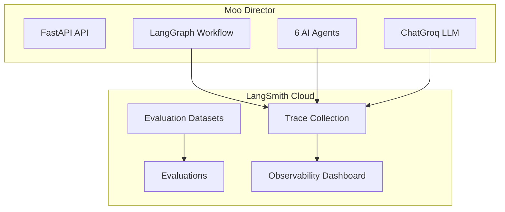

# LangSmith Integration

This document describes the LangSmith integration for observability and evaluation in Moo Director.

## Overview

Since the project uses LangChain and LangGraph, LangSmith integration is straightforward. LangSmith automatically traces all LangChain/LangGraph operations when the correct environment variables are set.

## Architecture



## Quick Start

### 1. Get a LangSmith API Key

1. Sign up at [https://smith.langchain.com](https://smith.langchain.com)
2. Create an API key from the settings page

### 2. Configure Environment

Add to your `.env` file:

```bash
LANGCHAIN_TRACING_V2=true
LANGCHAIN_API_KEY=lsv2_pt_xxxxx
LANGCHAIN_PROJECT=moo-director
```

### 3. Restart the Server

```bash
python main.py
```

You should see in the logs:
```
INFO: LangSmith tracing enabled for project: moo-director
```

### 4. Create a Scene

Run any scene creation request - traces will automatically appear in LangSmith.

### 5. View Traces

Visit [https://smith.langchain.com](https://smith.langchain.com) and select your project to see:
- Full LangGraph workflow visualization
- Each agent's LLM calls with inputs/outputs
- Token usage and latency per call

---

## Configuration

### Environment Variables

| Variable | Required | Default | Description |
|----------|----------|---------|-------------|
| `LANGCHAIN_TRACING_V2` | No | `false` | Enable/disable tracing |
| `LANGCHAIN_API_KEY` | No | - | LangSmith API key |
| `LANGCHAIN_PROJECT` | No | `moo-director` | Project name in LangSmith |
| `LANGCHAIN_ENDPOINT` | No | `https://api.smith.langchain.com` | LangSmith API endpoint |

### Settings in `config.py`

```python
# LangSmith Configuration (optional - enables tracing)
langchain_tracing_v2: bool = False
langchain_api_key: str = ""
langchain_project: str = "moo-director"
langchain_endpoint: str = "https://api.smith.langchain.com"
```

---

## Evaluation System

The evaluation module provides quality assessment for scene generation.

### Custom Evaluators

| Evaluator | Description |
|-----------|-------------|
| `scene_completeness_evaluator` | Checks if all requested objects are present |
| `prompt_alignment_evaluator` | Checks if output matches prompt keywords |
| `validation_pass_evaluator` | Checks if scene passed internal validation |
| `object_count_evaluator` | Checks if object count is reasonable |

### API Endpoints

#### Create Evaluation Dataset

```bash
curl -X POST http://localhost:8000/api/v1/evaluation/datasets/create \
  -H "Content-Type: application/json" \
  -d '{"dataset_name": "3d-scene-prompts"}'
```

#### List Datasets

```bash
curl http://localhost:8000/api/v1/evaluation/datasets
```

#### Run Batch Evaluation

```bash
curl -X POST http://localhost:8000/api/v1/evaluation/run \
  -H "Content-Type: application/json" \
  -d '{"dataset_name": "3d-scene-prompts"}'
```

#### Quick Evaluation (No LangSmith Required)

```bash
curl -X POST http://localhost:8000/api/v1/evaluation/quick \
  -H "Content-Type: application/json" \
  -d '{"prompt": "Create a cozy bedroom with a white bed"}'
```

Response:
```json
{
  "prompt": "Create a cozy bedroom with a white bed",
  "overall_score": 0.85,
  "evaluations": {
    "scene_completeness": {"score": 1.0, "reasoning": "..."},
    "prompt_alignment": {"score": 0.8, "reasoning": "..."},
    "validation_pass": {"score": 1.0, "reasoning": "..."},
    "object_count": {"score": 1.0, "reasoning": "..."}
  }
}
```

---

## Files Structure

```
backend/app/evaluation/
├── __init__.py              # Module exports
├── evaluator.py             # Dataset & evaluation functions
└── custom_evaluators.py     # Custom quality evaluators
```

### Key Functions

**evaluator.py:**
- `create_evaluation_dataset()` - Create datasets in LangSmith
- `run_scene_evaluation()` - Run batch evaluations
- `get_evaluation_results()` - Retrieve results from LangSmith
- `quick_evaluate_prompt()` - Ad-hoc single prompt evaluation

**custom_evaluators.py:**
- `scene_completeness_evaluator()` - Object presence validation
- `prompt_alignment_evaluator()` - Keyword matching
- `validation_pass_evaluator()` - Internal validation check
- `object_count_evaluator()` - Object count validation

---

## What You'll See in LangSmith

### Traces View

Each scene creation generates a trace showing:
- **Workflow execution** - Full LangGraph state machine visualization
- **Agent calls** - Each agent's process() method
- **LLM invocations** - Individual ChatGroq calls with:
  - Input prompts (system + user)
  - Output responses
  - Token counts (input/output)
  - Latency

### Metadata

Traces include custom metadata for filtering:
- `agent_name` - Which agent made the call
- `model` - LLM model used (e.g., `llama-3.3-70b-versatile`)

### Tags

Each trace is tagged with:
- `agent` - Identifies agent-related traces
- Agent-specific tags (e.g., `orchestrator`, `librarian`)

---

## Free Tier Limits

LangSmith free tier includes:
- **5,000 traces/month**
- **14-day trace retention**
- **Basic evaluation features**

### Recommendations

1. **Use sampling in production** - Not every request needs tracing
2. **Disable for health checks** - Health endpoints don't need traces
3. **Monitor usage** - Check your trace count in LangSmith dashboard

---

## Troubleshooting

### Traces Not Appearing

1. Check that `LANGCHAIN_API_KEY` is set correctly
2. Verify `LANGCHAIN_TRACING_V2=true`
3. Check server logs for "LangSmith tracing enabled"
4. Ensure you're looking at the correct project in LangSmith

### Evaluation Endpoints Return 500

1. Verify `LANGCHAIN_API_KEY` is configured
2. Check that the dataset exists (create it first)
3. Review server logs for detailed error messages

### High Latency

LangSmith tracing adds minimal overhead (~10-50ms per trace). If you notice significant latency:
1. Check your network connection to LangSmith
2. Consider using async tracing (default)
3. Reduce trace verbosity if needed

---

## Related Documentation

- [Getting Started](GETTING_STARTED.md) - Initial setup including LangSmith
- [API Documentation](API.md) - Full API reference including evaluation endpoints
- [Architecture](ARCHITECTURE.md) - System architecture with LangSmith integration
- [Deployment](DEPLOYMENT.md) - Production deployment with LangSmith secrets
